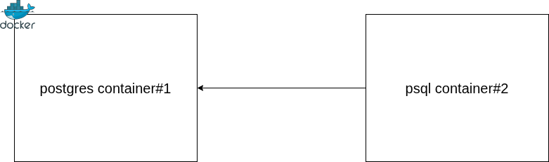
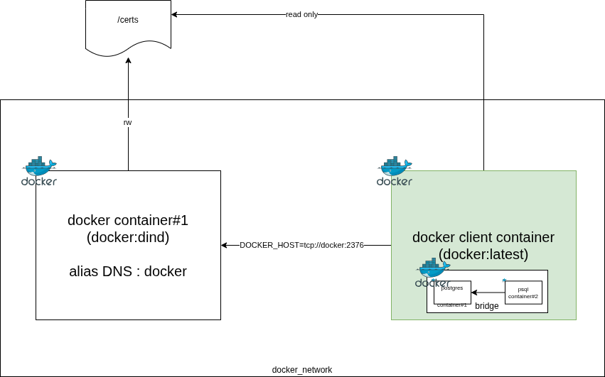
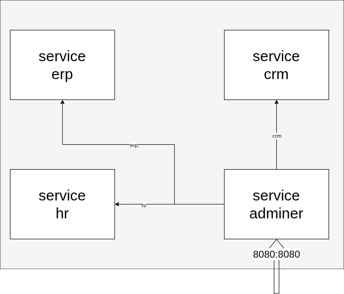
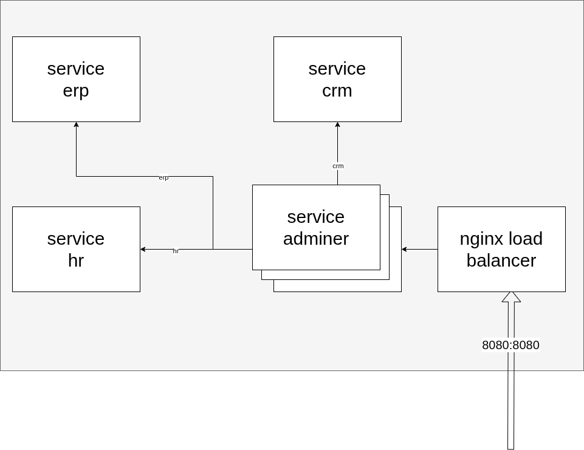

# Docker

## Exercice 1 - Conteneur postgres

Créer un conteneur basé sur l'image Postgres, et faire en sorte de se connecter à l'instance Postgres, sur la base de données tprevision en utilisant un autre conteneur possédant le binaire psql.

Le second conteneur doit être éphèmère - donc détruit à la fin de son exécution.

L'accès depuis le second conteneur au conteneur de l'instance doit se faire via un alias DNS exclusivement.

)

### Solution

1. Créer un conteneur correspondant à l'instance postgres avec la base de données par défaut `tprevision`

```bash
docker run --name db -d -e POSTGRES_DB=tprevision -e POSTGRES_PASSWORD=password  postgres:latest
```


2. Créer un nouveau sous réseau `revision_network`

```bash
docker network create revision_network
```


3. Associer le conteneur #1 au sous réseau `revision_network` avec l'alias DNS `db`

```bash
docker network connect revision_network db --alias db
```

4. Créer un conteneur éphèmère interactif rattaché au sous réseau `revision_network` déclenchant l'exécution d'une commande psql

```bash
docker run --rm --network revision_network -it postgres:latest psql -h db -U postgres tprevision
```

## Exercice 2 - Dind


Créer un conteneur basé sur l'image [dind](https://hub.docker.com/_/docker).

Créer un second conteneur capable de créer des conteneurs invisibles pour la machine hôte en utilisant le conteneur #1.

Depuis ce second conteneur, créer une instance postgres comme cela a été fait dans le 1er exercice.

### Vue d'ensemble

)

### Solution

1. Créer 2 volumes pour stocker les certificats générés

```bash
docker volume create docker-certs-ca
docker volume create docker-certs-client
```

2. Créer le sous réseau dind_network

```bash
docker network create dind_network
```


3. Créer un conteneur basé sur l'image docker:dind qui sera rattaché au sous-réseau dind_network

```bash
docker run --privileged --name docker-daemon -d --network dind_network --network-alias docker -e DOCKER_TLS_CERTDIR=/certs -v docker-certs-ca:/certs/ca -v docker-certs-client:/certs/client docker:dind
```


4. Créer un conteneur possédant le client docker pour créer d'autres conteneurs

```bash
docker run --rm --network dind_network -e DOCKER_TLS_CERTDIR=/certs -e DOCKER_HOST=tcp://docker:2376 -v docker-certs-client:/certs/client:ro docker:latest version
```

5. Créer un conteneur de base de données au sein du conteneur client docker

```bash
docker run -it --rm --network dind_network -e DOCKER_TLS_CERTDIR=/certs -e DOCKER_HOST=tcp://docker:2376 -v docker-certs-client:/certs/client:ro docker:latest sh
```

Puis créer le conteneur issu de l'exercice 1

```bash
docker run --name db -d -e POSTGRES_DB=tprevision -e POSTGRES_PASSWORD=password  postgres:latest
```

## Exercice 3 - Redirection avec stream


Utiliser l'image nginx pour créer un conteneur principal accessible sur le port 8002 depuis la machine hôte qui redirige le trafic vers une instance de base de données postgres.

)

Configurer nginx et notamment le fichier nginx.conf pour qu'il intègre l'utilisation du block

```
stream {

    upstream postgres {
        server db:5432;
    }

    server {
        listen 8002;
        proxy_pass postgres;
    }

}
```

### Solution

1. Récupérer le fichier de configuration `nginx.conf`

```bash
docker run --rm --entrypoint=cat nginx /etc/nginx/nginx.conf > ./nginx.conf
```

2. Modifier le fichier de configuration `nginx.confg` avec le bloc de code proposé dans l'énoncé

3. Créer un sous réseau tp_exo3

```bash
docker network create tp_exo3
```

4. Créer le conteneur nginx avec le nouveau fichier de configuration rattaché au réseau `tp_exo3`


```bash
docker run --name web-bdd --rm -v ./nginx.conf:/etc/nginx/nginx.conf:ro -d nginx
```


1. Créer un conteneur de base de données postgres avec l'alias DNS `db` rattaché au réseau `tp_exo3`

```bash
docker run --network tp_exo3 --network-alias db --name db -d -e POSTGRES_DB=tp_bdd_3 -e POSTGRES_PASSWORD=password  postgres:latest
```

```bash
docker network connect tp_exo3 web-bdd
docker start web-bdd
```

Tester la bonne redirection avec l'utilisation d'un client postgres compatible

Récupérer l'adresse IP de votre conteneur

```bash
docker inspect web-bdd --format='{{.NetworkSettings.Networks.tp_exo3.IPAddress}}'
```

```bash
psql -h localhost -p 8002 -U postgres tp_bdd_3
```

# Docker Compose

## Exercice 4

Proposer un [docker compose](https://docs.docker.com/compose/) qui doit créer les 4 services suivants :

* service PostgreSQL latest avec la base de données nommée `crm`
* service PostgreSQL 17 avec la base de données nommée `erp`
* service MySQL en latest avec la base de données nommées `hr`
* service adminer en latest

Le mot de passe par défaut est `password`.

)

Faire évoluer les services pour répondre à une problématique de montée en charge

)


1. Modifier le fichier de configuration nginx `nginx.conf` pour rediriger le traffic vers un ou plusieurs conteneurs du service `admin`

```

user  nginx;
worker_processes  auto;

error_log  /var/log/nginx/error.log notice;
pid        /run/nginx.pid;


events {
    worker_connections  1024;
}


stream {

    upstream adminweb {
        server admin:8080;
    }

    server {
        listen 80;
        proxy_pass adminweb;
    }

}
```

2. Créer un nouveau service `lb` qui s'appuie sur l'image `nginx:latest` et qui utilise le fichier modifié de configuration `nginx.conf`

```yaml
  lb:
    image: nginx:latest
    volumes:
      - ./nginx.conf:/etc/nginx/nginx.conf:ro
    ports:
      - '8006:80'
```

3. Modifier la configuration du service `admin` pour ne plus avoir de redirection de port statique et ainsi permettre la mise à l'échelle (scale) du service `admin`

```yaml
  admin:
    image: adminer:latest
```

4. Modifier le service `lb` pour s'assurer qu'il démarre en dernier : dépendance avec le service `admin` : [`depends_on`](https://docs.docker.com/reference/compose-file/services/#depends_on)

```yaml
  lb:
    image: nginx:latest
    volumes:
      - ./nginx.conf:/etc/nginx/nginx.conf:ro
    ports:
      - '8006:80'
    depends_on:
      - admin
```


5. Modifier le service `admin` pour s'assurer qu'il démarre après le démarrage complet des services de base de données.

```yaml
  admin:
    image: adminer:latest
    depends_on:
      - hr
      - crm
      - erp
```

# Docker Image

## Exercice 5 Création d'image

Créer une image, via Dockerfile, qui permet, à la création d'un container, d'afficher toutes les combinaisons de code en fonction du nombre de chiffres données en paramètre.

Peut être réalisé en Python.

Pensez à relire la documentation de [référence de Dockerfile](https://docs.docker.com/reference/dockerfile/).

```bash
docker run masuperimage:latest 2
00
01
02
...
98
99
```

```bash
docker run masuperimage:latest 3
000
001
002
...
998
999
```

Construire l'image

```bash
docker build -t masuperimage:latest .
```

Tester la création et l'exécution du conteneur

```bash
docker run masuperimage:latest 2
```
