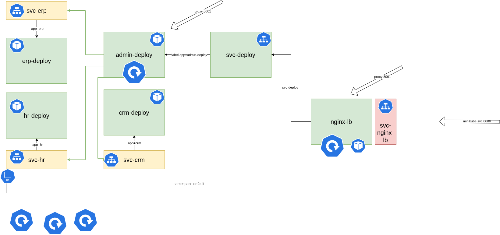
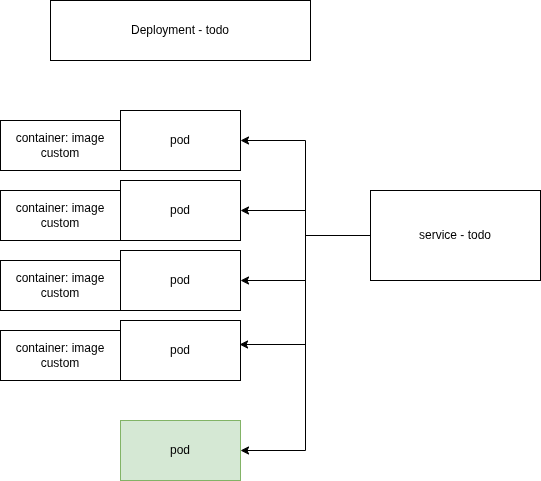

# Kubernetes

## Concepts

Aperçu issu de la documentation officielle


## Problématiques

3 problématiques adressées par Kubernetes

* Self Healing
* Autoscaling
* Automated Rollout

## Vue d'ensemble

)

## Installation

Minikube

```bash
curl -LO https://github.com/kubernetes/minikube/releases/latest/download/minikube-linux-amd64
sudo install minikube-linux-amd64 /usr/local/bin/minikube && rm minikube-linux-amd64
```

## Démarrage

```bash
minikube start --driver docker
```

```bash
minikube kubectl -- get po -A
```

```bash
minikube kubectl -- get namespace
```


```bash
minikube dashboard
```

## Exercice 1 : Créer un déploiement (self-healing)

```bash
kubectl create deployment deploynginx --image=nginx:latest
```

Essayer de supprimer le pod déployé

```bash
kubectl delete pod/deploynginx-
```

Créer une ressource pod simple

```bash
kubectl run podnginx --image=nginx:latest
```

Supprimer le pod podnginx

```bash
kubectl delete pod/podnginx
```


## Exercice 2 : Rollback (rollout)

Augmenter le nombre de pods dans un déploiement

```bash
kubectl scale deployment deploynginx --replicas=3
```

Afficher plus de détails sur une ressource

```bash
kubectl describe deploy/deploynginx
```


Une fois déployé, intéressons-nous à la nouvelle commande

```bash
kubectl rollout --help
```

Cette commande ne s'applique qu'à 3 types de ressources (deployments, daemonsets, statefulsets).


Pour consulter l'historique de versions

```bash
kubectl rollout history deployment deploynginx
```

Pour afficher le détail de la révision 1

```bash
kubectl rollout history deployment deploynginx --revision=1
```

Pour créer une nouvelle version, nous allons mettre à jour un élément qui est versionné, à savoir l'image par exemple

```bash
kubectl set image deployment deploynginx nginx=nginx:stable-alpine3.18-slim
```

Vérifier qu'une nouvelle version a bien été inscrite

```bash
kubectl rollout history deployment deploynginx
```

Consulter la nouvelle version

```bash
kubectl rollout history deployment deploynginx --revision=2
```

Défaire la dernière action compatible rollout

```bash
kubectl rollout undo deployment deploynginx
```

## Exercice 3 : 

)

Créer le ~~déploiement~~ pod hr ~~-deploy avec 1 pod~~

```bash
kubectl run hr --env="MYSQL_DATABASE=hr" --env="MYSQL_ROOT_PASSWORD=password" --image=mysql:latest
```

Tester la connexion en local depuis le pod avec le lancement d'un processus mysql au sein du conteneur associé au pod hr

```bash
kubectl exec -it pod/hr -- mysql -u root -p
```

Créer le ~~déploiement~~ crm ~~-deploy avec 1 pod~~

```bash
kubectl run crm --env="POSTGRES_DB=crm" --env="POSTGRES_PASSWORD=password" --image=postgres:latest
```


Créer le ~~déploiement~~ erp ~~-deploy avec 1 pod~~

```bash
kubectl run erp --env="POSTGRES_DB=erp" --env="POSTGRES_PASSWORD=password" --image=postgres:latest
```

Tester la connexion à l'instance postgres

```bash
kubectl exec -it pod/crm -- psql -U postgres
```


Créer le déploiement admin-deploy avec 3 pods

```bash
kubectl create deployment admin-deploy --image=adminer:latest --replicas=3
```


Accéder aux bases de données en passant par le proxy

```bash
kubectl proxy
```

Accéder à l'interface via l'adresse http://localhost:8001/api/v1/namespaces/default/pods/admin-deploy-84f8d4946f-wch77:8080/proxy/

Récupérer l'adresse IP du conteneur d'un POD

```bash
kubectl describe pod/crm
```

Créer un service qui expose le déploiement admin-deploy

```bash
kubectl expose deployment admin-deploy --port=8080
```

Créer l'image et la tagger avec le repo disponible sur dockerhub

```bash
cd exercice4
docker build -t lb-nginx:latest .
docker image tag lb-nginx:latest argonaulteshexagone/nginxlb:latest
docker push argonaulteshexagone/nginxlb:latest
```

Utiliser cette image sur le registre public pour créer un déploiement basé sur cette nouvelle image

```bash
kubectl create deployment nginxlb --image=argonaulteshexagone/nginxlb:latest --replicas=2
```

Détruire le service avec l'ancien nom

```bash
kubectl delete svc/admin-deploy
```

Recréer avec le nom adapté

```bash
kubectl expose deployment admin-deploy --name admin --port=8080
```

Créer un service pour chaque base

```bash
kubectl expose pod erp --name svc-erp --port=5432
kubectl expose pod crm --name svc-crm --port=5432
kubectl expose pod hr --name svc-hr --port=3306
```

Attention à l'utilisation de plusieurs pods pour deploy-admin, il n'y a pas d'affinité par session et donc à chaque requête la session est potentiellement perdu.

Créer un service de type NodePort

```bash
kubectl expose deployment nginxlb --name svc-nginxlb --port=90 --type=No
dePort
```

Pour finir, exposer le service à l'extérieur du cluster minikube avec la commande

```bash
minikube service svc-nginxlb
```

## Exercice 4 :

Convertir en fichier yaml les instructions impératives de l'exercice #3.

Pour récupérer la définition d'une ressource existante au format yaml

```bash
kubectl get pod/hr -o yaml
```

Commade pour appliquer les fichiers déclaratifs

```bash
kubectl apply -f pod0.yaml
```

Commande pour appliquer un dossier kustomization


```bash
kubectl apply -k folder
```

## Exercice 5 : ConfigMap et Secret

Pour créer une ressource configmap depuis la CLI

```bash
kubectl create configmap db-names --from-literal HR_DB=hr
```

Et la même commande avec plusieurs variables créées.

```bash
kubectl create configmap db-names --from-literal=HR_DB=hr --from-literal=CRM_DB=crm --from-literal=ERP_DB=erp
```

Pour obtenir la valaeur d'un configmap

```bash
kubectl get configmap db-names -o jsonpath='{.data.HR_DB}'
```

Pour créer une ressource configmap en yaml

```yaml
apiVersion: v1
kind: ConfigMap
metadata:
  name: db-names
data:
  HR_DB: human_resources
```

## Exercice : Manipulation des volumes


Créer et rattacher un volume local à un pod simple nginx

Voir le fichier [podvol.yaml](./kube_volumes/podvol.yaml)

Créer et rattacher un pvc à un pod

Voir le fichier [podpvc.yaml](./kube_volumes/podpvc.yaml)

Déclarer des demandes de volume (pvc) à associer à des templates de pod

Voir le fichier [deploypvc.yaml](./kube_volumes/deploypvc.yaml)

Déclarer des nouvelles créations de volumes à chaque nouvelle création de pod

Voir le fichier [deploypvctemplate.yaml](./kube_volumes/deploypvctemplate.yaml)

Quelques commandes pour manipuler les pods

Lancer un nouveau processus bash interactif dans le pod deploypvctemplate-0

```bash
kubectl exec -it pod/deploypvctemplate-0 -- bash
```

Garder un oeil sur la liste des pods

```bash
kubectl get pods -l app=deploypvc --watch
```

Augmenter le nombre de replicas d'un statefulset

```bash
kubectl scale statefulset deploypvctemplate --replicas=3
```

Supprimer un pod

```bash
kubectl delete pod/deploypvctemplate-0
```


## Exercice 6 Consolidation des connaissances

Le projet de départ est disponible sur [github](https://github.com/argonaultes-education/todos-api.git).

Question complémentaire : Comment faire pour qu'un pod non issu du déploiement `todo` soit quand même servi par le service `todo` ?

)

Afficher sur la page web la valeur d'un token dont la définition est stockée dans une configmap.

### Correction

1. Cloner le projet fourni

```bash
git clone https://github.com/argonaultes-education/todos-api.git
```

2. Tenter de créer l'image via la commande `docker build`

```bash
docker build -t todo-api-hexagone:2026 .
```

3. Supprimer l'instruction `bun test` dans le fichier Dockerfile et relancer la construction de l'image

4. Tester la création d'un conteneur Docker basé sur l'image nouvelle créée

```bash
docker run --rm -p 3002:3002 todo-api-hexagone:2026
```

Tester le bon fonctionnement du conteneur avec la commande `curl`

```bash
curl http://localhost:3002
```


5. Ajouter la déclaration `const ips` et recréer une nouvelle fois l'image Docker

6.a Charger la nouvelle image dans le cache des images du cluster kubernetes géré par minikube

```bash
```

6.b Passer par le registre public docker.io

  * se connecter en ligne de commande à docker.io avec un compte valide

```bash
docker login -u your_username
```

  * créer un repository depuis l'interface web destiné à cette nouvelle image

  * tagger l'image déjà construite

```bash
docker image tag localimage your_username/image:tag
```

  * envoyer l'image sur le registre distant

```bash
docker push your_username/image:tag
```

1. Initialiser le dossier `todo-apis` au format kustomization
   1. la déclaration du configmap pour alimenter la variable d'environnement API_TOKEN
   2. la déclaration du déploiement et donc du pod template utilisant l'image nouvellement créée
   3. la déclaration du service de type `NodePort` qui rendra accessible l'application web depuis l'extérieur du cluster

```bash
kubectl apply -k todo-apis
```


2. Utiliser la commande `service` de `minikube` pour rediriger le trafic de la machine hôte vers le service visé

```bash
minikube service todo
```

Visualiser les logs de tous les pods

```bash
kubectl logs --all-pods deployment/todo -f
```

3.  Créer un nouveau pod (non rattaché à un déploiement) en s'appuyant sur la déclaration précédente mais qui reprend les mêmes labels que les pods du déploiement `todo`

```bash
kubectl apply -f todo-apis/podsolo.yaml
```


4.  Tester avec une boucle `curl` pour constater que les différents pods du déploiement et le pod autonome sont bien utilisés pour la redirection

Réduire le nombre de réplicas pour faciliter le debug

```bash
kubectl scale deployment/todo --replicas=2
```

Visualiser les logs des pods

```bash
kubectl logs -f pod/todo-api
```

Tester avec la commande curl

```bash
for i in $(seq 1 10) ; do curl http://192.168.49.2:31127 ; done
```

Pour terminer, libérer toutes les ressources

```bash
kubectl delete -f todo-apis/podsolo.yaml
kubectl delete -k todo-apis
```