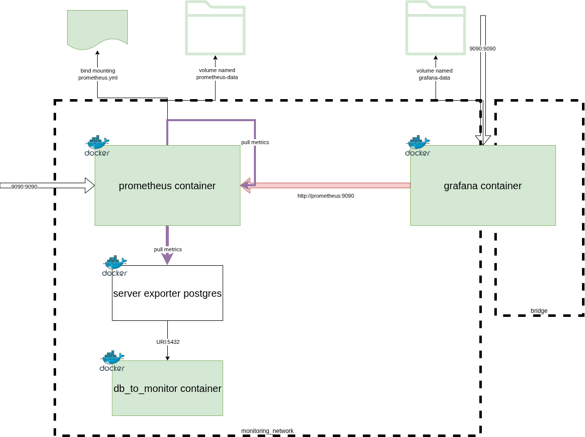

# Monitoring

## Prometheus

Présentation de l'architecture globale


### Installation et premiers pas

Démarrer un conteneur docker basé sur l'image `prom/prometheus`

```bash
docker run -p 9090:9090 prom/prometheus
```

Accéder à l'interface web de gestion et de configuration

Voir `http://localhost:9090/`

Accéder au point d'accès qui expose les metrics.

Voir `http://localhost:9090/metrics`

Récupérer le fichier de configuration global

Modifier les valeurs de scrapping :

* scrape_interval: 10s
* scrape_timeout: 20s

Récupérer le fichier

```bash
docker cp determined_almeida:/etc/prometheus/prometheus.yml ./
```

Modifier les valeurs et recréer un conteneur avec un point de montage sur ce fichier

```bash
docker run -v ./monitoring/prometheus.yml:/etc/prometheus/prometheus.yml:ro -p 9090:9090 --rm prom/prometheus
```

Nous obtenons l'erreur suivante :

```
err="parsing YAML file /etc/prometheus/prometheus.yml: global scrape timeout greater than scrape interval"
```

Ensuite essayer avec les valeurs suivantes :

* scrape_interval: 10s
* scrape_timeout: 5s

Le serveur démarre.

```bash
docker run -v ./monitoring/prometheus.yml:/etc/prometheus/prometheus.yml:ro -p 9090:9090 --rm prom/prometheus
```

Modifier les labels, ajouter le label `city=Versailles` et redémarrer le conteneur.

Sauvegarder les données stockées

```bash
docker volume create prometheus-data
```

```bash
docker run -v ./monitoring/prometheus.yml:/etc/prometheus/prometheus.yml:ro -p 9090:9090 -v prometheus-data:/prometheus --rm -d prom/prometheus
```

Convertir en fichier compose

```yaml
services:
    prometheus:
      image: prom/prometheus:latest
      volumes:
          - prometheus-data:/prometheus
          - ./prometheus.yml:/etc/prometheus/prometheus.yml:ro
      ports:
          - "9090:9090"

volumes:
    prometheus-data:
```

## Grafana

### Installation et premiers pas

Démarrer un conteneur basé sur l'image grafana

```bash
docker run -d -p 3000:3000 --network monitoring_default --name=grafana grafana/grafana-enterprise
```

Connecter le conteneur actif grafana au réseau `monitoring_default`

```bash
docker network connect monitoring_default grafana
```

### Ajouter target postgres



Utiliser [PostgreSQLExporter](https://github.com/prometheus-community/postgres_exporter)

1. Modifier le fichier compose.yaml pour intégre un service capable d'interroger la base de données afin d'extraire des métriques au format promotheus
2. Modifier le fichier de configuration prometheus.yml pour déclarer en tant que cible valide le nouveau service exporter postgres
3. Afficher dans un tableau de bord grafana les métriques spécifiques à l'instance postgres pour suivre son activité (nb de requêtes SQL, durée d'exécution, nombre de connexions)