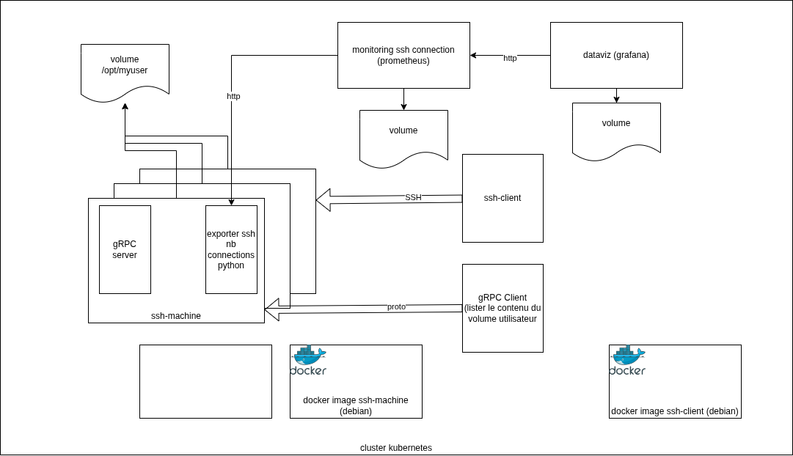

# TP

## Vue conceptuelle



## Description détaillée

L'objectif est de fournir un environnement stable de travail accessible en SSH depuis un pod éphémère.

L'environnement de travail doit être scalable (horizontalement). Les données créés par l'utilisateur doivent être conservées et récupérables quelque soit le nombre d'environnements.

Pour compléter l'environnement, 2 solutions de supervision accompagnent l'environnement de travail :
* le couple prometheus/grafana lié à un client personnalisé écrit en Python
* un client gRPC capable de lister le contenu du dossier de travail de l'utilisateur

## Vue technique


## Livrables

* Image Docker qui permet de créer un serveur SSH basé sur une debian : **Dockerfile**
* Image Docker qui permet de démarrer un serveur gRPC dont la fonction est de lister le contenu d'un dossier : **Dockerfile**
* Image Docker qui permet d'exposer une métrique au format prometheus qui compte le nombre de connexions tracées dans un fichier de log SSH : **Dockerfile**
* Image Docker qui permet d'utiliser un client SSH : **Dockerfile**
* Image Docker qui permet de faire appel a gRPC server : **Dockerfile**
* Images déjà construites :
  * **Grafana**
  * **Prometheus**
* Dossier kustomization qui permet de construire les ressources suivantes via des fichiers yaml :
  * volumes
    * grafana
    * prometheus
    * ssh_user
  * statefulset
    * prometheus
    * grafana
  * déploiement
    * sshmachine
  * services
    * prometheus (ClusterIP)
    * grafana (NodePort)
    * sshmachine (ClusterIP ssh)
    * sshmachine (ClusterIP http prom)
    * sshmachine (ClusterIP proto grpc)

## Liste de tâches

* [x] Rédiger un Dockerfile permettant de construire une image basée sur debian qui démarre un serveur ssh avec un utilisateur préexistant - 14h25
* [x] Rédiger un Dockerfile permettant de construire une image basée sur Debian avec un client ssh permettant de tester l'image - 14h25
* [ ] Rédiger un Dockerfile permettant de démarrer le serveur gRPC défini dans un script Python avec les imports nécessaires (fichiers générés par protoc)
* [ ] Rédiger un Dockerfile permettant de démarrer le script Python utilisant le stub gRPC correspondant. Inclure les imports nécessaires (fichiers générés par protoc)
* [ ] Rédiger un Dockerfile permettant de démarrer un script python qui lit un fichier de log et expose le résultat de cette lecture au format metrics prometheus en utilisant le client python [prometheus-client](https://github.com/prometheus/client_python)
* [ ] Rédiger le fichier yaml de définition du statefulset pour grafana
* [ ] Rédiger le fichier yaml de définition du statefulset pour prometheus
* [ ] Rédiger le fichier yaml de création du **configmap** et utilisation en tant que volume pour personnaliser les target prometheus `/etc/prometheus/prometheus.yml`
* [ ] Rédiger le fichier yaml de création du déploiement du pod sshmachine qui regroupe 3 conteneurs.
* [ ] Rédiger le fichier kustomization pour déclencher la création de l'ensemble des ressources avec 1 pod pour chaque déploiement/statefulset
* [ ] Rédiger les fichiers yaml de défintion de services correspondants

## Pas à pas

### Serveur SSH

Construction de l'image

```bash
docker build -t tp_mysshserver:latest -f Dockerfile.sshserver .
```

Génération de la paire de clé à utiliser pour la suite

```bash
ssh-keygen
```

récupérer la clé SSH du conteneur

```bash
docker cp jolly_mayer:/root/.ssh/id_ed25519.pub ./
```

### Client SSH

Construire l'image pour le client

```bash
docker build -t tp_mysshclient:latest -f Dockerfile.sshclient .
```

Tester la connexion vers le ssh associé

```bash
docker run -it --rm tp_mysshclient:latest
```