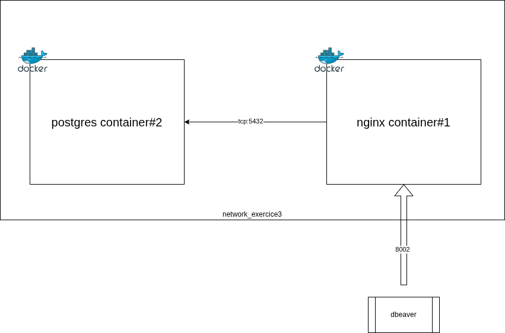

# Docker

## Exercice 1 - Conteneur postgres

Créer un conteneur basé sur l'image Postgres, et faire en sorte de se connecter à l'instance Postgres, sur la base de données tprevision en utilisant un autre conteneur possédant le binaire psql.

Le second conteneur doit être éphèmère - donc détruit à la fin de son exécution.

L'accès depuis le second conteneur au conteneur de l'instance doit se faire via un alias DNS exclusivement.


### Solution

1. Créer un conteneur correspondant à l'instance postgres avec la base de données par défaut `tprevision`

```bash
docker run --name db -d -e POSTGRES_DB=tprevision -e POSTGRES_PASSWORD=password  postgres:latest
```


2. Créer un nouveau sous réseau `revision_network`

```bash
docker network create revision_network
```


3. Associer le conteneur #1 au sous réseau `revision_network` avec l'alias DNS `db`

```bash
docker network connect revision_network db --alias db
```

4. Créer un conteneur éphèmère interactif rattaché au sous réseau `revision_network` déclenchant l'exécution d'une commande psql

```bash
docker run --rm --network revision_network -it postgres:latest psql -h db -U postgres tprevision
```

## Exercice 2 - Dind


Créer un conteneur basé sur l'image [dind](https://hub.docker.com/_/docker).

Créer un second conteneur capable de créer des conteneurs invisibles pour la machine hôte en utilisant le conteneur #1.

Depuis ce second conteneur, créer une instance postgres comme cela a été fait dans le 1er exercice.

### Vue d'ensemble


### Solution

1. Créer 2 volumes pour stocker les certificats générés

```bash
docker volume create docker-certs-ca
docker volume create docker-certs-client
```

2. Créer le sous réseau dind_network

```bash
docker network create dind_network
```


3. Créer un conteneur basé sur l'image docker:dind qui sera rattaché au sous-réseau dind_network

```bash
docker run --privileged --name docker-daemon -d --network dind_network --network-alias docker -e DOCKER_TLS_CERTDIR=/certs -v docker-certs-ca:/certs/ca -v docker-certs-client:/certs/client docker:dind
```


4. Créer un conteneur possédant le client docker pour créer d'autres conteneurs

```bash
docker run --rm --network dind_network -e DOCKER_TLS_CERTDIR=/certs -e DOCKER_HOST=tcp://docker:2376 -v docker-certs-client:/certs/client:ro docker:latest version
```

5. Créer un conteneur de base de données au sein du conteneur client docker

```bash
docker run -it --rm --network dind_network -e DOCKER_TLS_CERTDIR=/certs -e DOCKER_HOST=tcp://docker:2376 -v docker-certs-client:/certs/client:ro docker:latest sh
```

Puis créer le conteneur issu de l'exercice 1

```bash
docker run --name db -d -e POSTGRES_DB=tprevision -e POSTGRES_PASSWORD=password  postgres:latest
```

## Exercice 3 - Redirection avec stream


Utiliser l'image nginx pour créer un conteneur principal accessible sur le port 8002 depuis la machine hôte qui redirige le trafic vers une instance de base de données postgres.



Configurer nginx et notamment le fichier nginx.conf pour qu'il intègre l'utilisation du block

```
stream {

    upstream postgres {
        server db:5432;
    }

    server {
        listen 8002;
        proxy_pass postgres;
    }

}
```