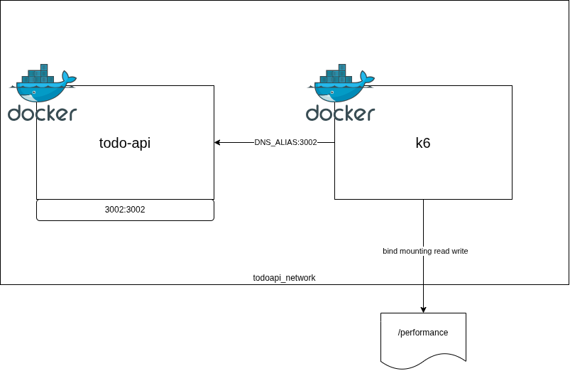

# Tests de performance


## Outils

Les outils à tester

* k6 : JavaScript
* Apache JMeter : XML (GUI)
* Locust : Python
* (Postman) : GUI

* LoadRunner (HP) : C

## Préparer environnement de test

Récupérer les sources du projet todo-api

```bash
git clone https://github.com/argonaultes-education/todos-api.git
```

Construire en l'image en ayant effectué les modificaitons nécessaires

```bash
docker build -t todo-api-hexagone:2026 .
```

Créer le sous-réseau

```bash
docker network create todoapi_network
```

Démarrer le conteneur

```bash
docker run -d --network todoapi_network --network-alias todoapi --name todo-api --rm -p 3002:3002 --cpus 2 --memory 4G --memory-swap 4G argonaulteshexagone/todo-api-hexagone:2026
```

## k6



Démarrer k6 et créer un nouveau fichier en se basant sur la [documentation](https://grafana.com/docs/k6/latest/using-k6/http-requests/).


```javascript
import http from 'k6/http';

export default function () {
  http.get('http://localhost:3002');
}
```

Récupérer l'image

```bash
docker pull grafana/k6
```

Démarrer notre script

```bash
docker run --network todoapi_network --rm -t -v ./performance/:/performance/ grafana/k6 run /performance/script.js
```

Augmenter la durée du test et le nombre d'utilisateurs

```bash
docker run --network todoapi_network --rm -t -v "${pwd}/performance/:/performance/" grafana/k6 run --vus 10 --duration 30s /performance/script.js
```

Ajouter les variables d'environnement pour augmenter le nombre de boucles et exporter les résultats ous forme de tableau de bord

```bash
docker run -e NB_LOOPS=2 -e K6_WEB_DASHBOARD=true -e K6_WEB_DASHBOARD_EXPORT=/performance/output/html-report.html --network todoapi_network --rm -t -v ./performance/:/performance/ grafana/k6 run --vus 10 --duration 30s /performance/script.js
```

## Apache JMeter

### Prérequis

Vérifier que Java 8+ est disponible

```bash
java -version
```

### Installation

Télécharger et extraire les composantes de l'archive

```bash
wget https://dlcdn.apache.org//jmeter/binaries/apache-jmeter-5.6.3.tgz
```

Extraire le composants

```bash
tar -xzf apache-jmeter-5.6.3.tgz
```

Aller dans le dossier `./apache-jmeter-5.6.3/bin/` et lancer le script

```bash
./jmeter
```

Rendre accessible depuis le PATH les scripts jmeter

```bash
export PATH=/datadisk/apache-jmeter-5.6.3/bin:$PATH
```


Lancer le script avec la commande

```bash
jmeter -n -t performance/testplan.jmx -l performance/output/testplan.log -e
```

Attention, cette commande crée les ressources suivantes :

* `report-output/statistics.json`
* `performance/output/testplan.log`
* `jmeter.log`

## Nouveau système soumis à des tests

Application avec une page qui présentera un formulaire demandant un titre de jeu.

L'application présentera le nombre de fois que ce jeu a été renseigné.

### Marche à suivre pour la création du projet

Initialiser le projet

```bash
uv init --bare .
```

Ajouter le module flask au projet

```bash
uv add flask
```

Modifier les scripts, etc...

Démarrer le serveur en utilisant comme script d'entrée le fichier `main.py`

```bash
uv run flask --app main run --debug
```

Si besoin, pour extraire la liste des dépendances au format requirements

```bash
uv export --format requirements-txt > requirements.txt
```


### Exercice 1

Créer 1 script js avec JMeter qui suit le scénario :

1. afficher la page contenant l'input
2. envoyer une valeur de jeu prise au hasard parmi une liste prédéfinie
3. vérifier que la réponse contient la valeur envoyée ainsi que la valeur de `count` > 0

Une fois le script réalisée, lancer le test avec 10 utilisateurs pour 10 itérations et 2 itérations par thread

```bash
jmeter -n -t performance/testplan-sut.jmx -Jthreads=10 -Jrampup=10 -Jloopcount_thread=10 -Jloopid=2 -l performance/output/testplan-sut.log -e
```

Faire le même script avec k6