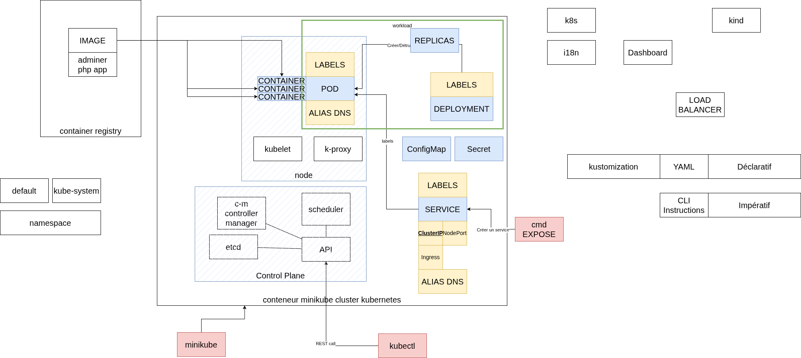
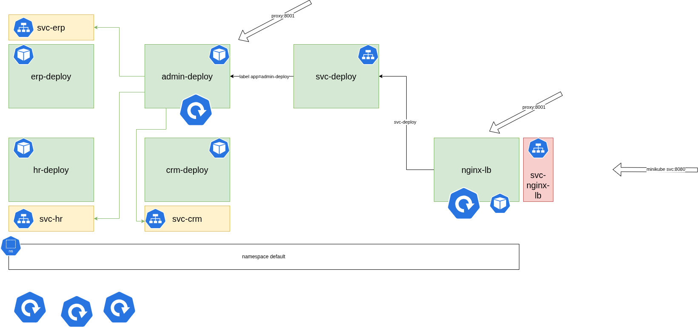

# Kubernetes

## Vue d'ensemble



## Installation

Minikube

```bash
curl -LO https://github.com/kubernetes/minikube/releases/latest/download/minikube-linux-amd64
sudo install minikube-linux-amd64 /usr/local/bin/minikube && rm minikube-linux-amd64
```

## Démarrage

```bash
minikube start --driver docker
```

```bash
minikube kubectl -- get po -A
```

```bash
minikube kubectl -- get namespace
```


```bash
minikube dashboard
```

## Exercice 1 : Créer un déploiement (self-healing)

```bash
kubectl create deployment deploynginx --image=nginx:latest
```

Essayer de supprimer le pod déployé

```bash
kubectl delete pod/deploynginx-
```

Créer une ressource pod simple

```bash
kubectl run podnginx --image=nginx:latest
```

Supprimer le pod podnginx

```bash
kubectl delete pod/podnginx
```


## Exercice 2 : Rollback

Augmenter le nombre de pods dans un déploiement

```bash
kubectl scale deployment deploynginx --replicas=3
```

Afficher plus de détails sur une ressource

```bash
kubectl describe deploy/deploynginx
```


Une fois déployé, intéressons-nous à la nouvelle commande

```bash
kubectl rollout --help
```

Cette commande ne s'applique qu'à 3 types de ressources (deployments, daemonsets, statefulsets).


Pour consulter l'historique de versions

```bash
kubectl rollout history deployment deploynginx
```

Pour afficher le détail de la révision 1

```bash
kubectl rollout history deployment deploynginx --revision=1
```

Pour créer une nouvelle version, nous allons mettre à jour un élément qui est versionné, à savoir l'image par exemple

```bash
kubectl set image deployment deploynginx nginx=nginx:stable-alpine3.18-slim
```

Vérifier qu'une nouvelle version a bien été inscrite

```bash
kubectl rollout history deployment deploynginx
```

Consulter la nouvelle version

```bash
kubectl rollout history deployment deploynginx --revision=2
```

Défaire la dernière action compatible rollout

```bash
kubectl rollout undo deployment deploynginx
```

## Exercice 3 : 



Créer le ~~déploiement~~ pod hr ~~-deploy avec 1 pod~~

```bash
kubectl run hr --env="MYSQL_DATABASE=hr" --env="MYSQL_ROOT_PASSWORD=password" --image=mysql:latest
```

Tester la connexion en local depuis le pod avec le lancement d'un processus mysql au sein du conteneur associé au pod hr

```bash
kubectl exec -it pod/hr -- mysql -u root -p
```

Créer le ~~déploiement~~ crm ~~-deploy avec 1 pod~~

```bash
kubectl run crm --env="POSTGRES_DB=crm" --env="POSTGRES_PASSWORD=password" --image=postgres:latest
```


Créer le ~~déploiement~~ erp ~~-deploy avec 1 pod~~

```bash
kubectl run erp --env="POSTGRES_DB=erp" --env="POSTGRES_PASSWORD=password" --image=postgres:latest
```

Tester la connexion à l'instance postgres

```bash
kubectl exec -it pod/crm -- psql -U postgres
```


Créer le déploiement admin-deploy avec 3 pods

```bash
kubectl create deployment admin-deploy --image=adminer:latest --replicas=3
```


Accéder aux bases de données en passant par le proxy

```bash
kubectl proxy
```

Accéder à l'interface via l'adresse http://localhost:8001/api/v1/namespaces/default/pods/admin-deploy-84f8d4946f-wch77:8080/proxy/

Récupérer l'adresse IP du conteneur d'un POD

```bash
kubectl describe pod/crm
```

Créer un service qui expose le déploiement admin-deploy

```bash
kubectl expose deployment admin-deploy --port=8080
```

Créer l'image et la tagger avec le repo disponible sur dockerhub

```bash
cd exercice4
docker build -t lb-nginx:latest .
docker image tag lb-nginx:latest argonaulteshexagone/nginxlb:latest
docker push argonaulteshexagone/nginxlb:latest
```

Utiliser cette image sur le registre public pour créer un déploiement basé sur cette nouvelle image

```bash
kubectl create deployment nginxlb --image=argonaulteshexagone/nginxlb:latest --replicas=2
```

Détruire le service avec l'ancien nom

```bash
kubectl delete svc/admin-deploy
```

Recréer avec le nom adapté

```bash
kubectl expose deployment admin-deploy --name admin --port=8080
```

Créer un service pour chaque base

```bash
kubectl expose pod erp --name svc-erp --port=5432
kubectl expose pod crm --name svc-crm --port=5432
kubectl expose pod hr --name svc-hr --port=3306
```

Attention à l'utilisation de plusieurs pods pour deploy-admin, il n'y a pas d'affinité par session et donc à chaque requête la session est potentiellement perdu.

Créer un service de type NodePort

```bash
kubectl expose deployment nginxlb --name svc-nginxlb --port=90 --type=No
dePort
```

Pour finir, exposer le service à l'extérieur du cluster minikube avec la commande

```bash
minikube service svc-nginxlb
```

## Exercice 4 :

Convertir en fichier yaml les instructions impératives de l'exercice #3.

Pour récupérer la définition d'une ressource existante au format yaml

```bash
kubectl get pod/hr -o yaml
```

Commade pour appliquer les fichiers déclaratifs

```bash
kubectl apply -f pod0.yaml
```

Commande pour appliquer un dossier kustomization


```bash
kubectl apply -k folder
```

```